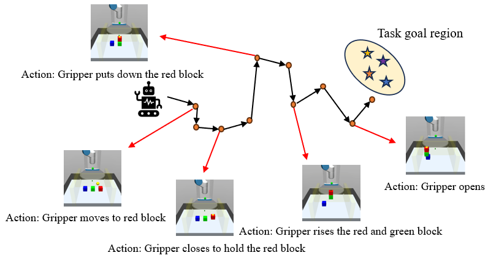
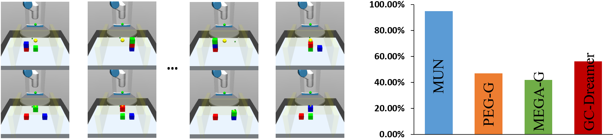

# Learning World Models for Unconstrained Goal Navigation (MUN)
Yuanlin Duan, Wensen Mao and He Zhu

Code for "Learning World Models for Unconstrained Goal Navigation" (NeurIPS 2024), a method to improve the quality of world model in MBRL.

If you find our paper or code useful, please reference us:
```
@article{duan2024learning,
  title={Learning World Models for Unconstrained Goal Navigation},
  author={Duan, Yuanlin and Mao, Wensen and Zhu, He},
  journal={arXiv preprint arXiv:2411.02446},
  year={2024}
}
```


## Model-based GCRL Framework:


The richness of environment space and dynamics captured by the replay buffer sets the upper limit for what the world model can learn about the real world. It also significantly influences the training level of the policy.

## MUN's bidirectional Replay Buffer
MUN learns a world model from state transitions between any states in the replay buffer (whether tracing back along recorded trajectories or transitioning across separate trajectories).

Previous Replay Buffer: One-way direction

Our Method (MUN)’s Replay Buffer: Two-way direction 


## Key Subgoal

During the trajectory evolution towards the agent's goal, there often exist certain states termed as key subgoal states. 



We observed that key subgoal states typically correspond to actions with significant differences. So we designed DAD alogorithm to find key subgoal states.
  
Some key subgoals found by DAD:


## Experiments results

MUN trains better policies in different tasks compared with other baselines:


Success rate of MUN crossing different key subgoal pairs:




## Code Structure

```
MUN/
  |- Config/                        # config file for each environment.
  |- dreamerv2_APS/                 # MUN implement
  |- dreamerv2_APS/gc_main.py       # Main running file
```

### Step 1: MUN installation

pip intall all dependencies:

```bash
pip install -r library.txt
```

And then, run:

```bash
pip install -e .
```

### Step 2: Environment installation
We evaluate MUN on six environments: Ant Maze, Walker, 3-block Stacking, Block Rotation, Pen Rotation, Fetch Slide.

MUJOCO install: [MuJoCo 2.0](https://www.roboti.us/download.html)

Ant Maze, 3-Block Stack environments:

The `mrl` codebase contains Ant Maze and 3-block Stack environments.
```bash
git clone https://github.com/hueds/mrl.git
```

Before testing these two environments, you should make sure that the `mrl` path is set in the `PYTHONPATH`.

```bash
# if you want to run environments in the mrl codebase(Ant Maze, 3-block Stacking)
export PYTHONPATH=<path to your mrl folder>
```

Walker environment:

Clone the `lexa-benchmark` and `dm_control` repos.

```bash
git clone https://github.com/hueds/dm_control
git clone https://github.com/hueds/lexa-benchmark.git
```

Set up `dm_control` as a local python module:
```bash
cd dm_control
pip install .
```

Set `LD_PRELOAD` to the libGLEW path, and set the `MUJOCO_GL` and `MUJOCO_RENDERER` variables.

```bash
# if you want to run environments in the lexa-benchmark codebase
MUJOCO_GL=egl MUJOCO_RENDERER=egl LD_PRELOAD=/usr/lib/x86_64-linux-gnu/libGLEW.so:/usr/lib/x86_64-linux-gnu/libGL.so  PYTHONPATH=<path to your lexa-benchmark folder like "/home/edward/lexa-benchmark">
```


### Step 3: Run MUN

Training Scripts:

```bash
python dreamerv2_APS/gc_main.py --configs RotatePen(environment name in config file) --logdir "your logdir path"
```

Use the tensorboard to check the results.

```bash
tensorboard --logdir ~/logdir/your_logdir_name
```

## Acknowledgements
MUN builds on many prior works, and we thank the authors for their contributions.

- [PEG](https://github.com/penn-pal-lab/peg) for the goal-cond MBRL Agent and goal picking for exploration implement
- [Dreamerv2](https://github.com/danijar/dreamerv2) for the non-goal-cond. MBRL agent
- [LEXA](https://github.com/orybkin/lexa) for goal-cond. policy training logic, P2E exploration, and Walker task
- [mrl](https://github.com/spitis/mrl) for their implement of baselines and environments
